# AttendSmartly - College Attendance Tracker & Bunk Calculator

<div align="center">


[](LICENSE)
[](https://kotlinlang.org/)
[](https://developer.android.com/jetpack/compose)
[-brightgreen.svg?logo=android)](https://android.com)
[](https://developer.android.com/topic/architecture)
[](.github/workflows/android.yml)

**Track classes. Plan bunks. Attend smartly.**

*The ultimate open-source college attendance management, timetable builder, and safe bunk calculator for Android.*

</div>

---

## 📌 Table of Contents

- [Overview](#-overview)
- [Key Features](#-key-features)
- [Bunk & Recovery Math](#-bunk--recovery-math)
- [Tech Stack & Architecture](#-tech-stack--architecture)
- [Screen Tour & Capabilities](#-screen-tour--capabilities)
- [Getting Started & Installation](#-getting-started--installation)
- [Building from Source](#-building-from-source)
- [Frequently Asked Questions (FAQ)](#-frequently-asked-questions-faq)
- [Privacy & Open Source](#-privacy--open-source)
- [Author & License](#-author--license)

---

## 💡 Overview

**AttendSmartly** is a clean, modern, student-focused Android attendance-tracking application built natively with **Kotlin**, **Jetpack Compose**, **Material Design 3**, and **Room Database**.

College academic rules often demand a mandatory minimum attendance threshold (e.g. 75% or 80%) with complex multi-hour class structures where practical labs count differently than single lectures. AttendSmartly takes the guesswork out of attendance tracking by calculating your exact **Safe Bunks** and **Recovery Classes** in real time.

---

## ✨ Key Features

### 📅 Smart Weekly Timetable Scheduling
- Configure recurring daily classes, room numbers, instructor names, and specific class types (Lecture, Practical Lab, Tutorial).
- Flexible day-by-day scheduler with instant daily agenda views.

### ⏱️ Multi-Hour & Partial Unit Tracking
- Real-world college classes aren't always 1 hour. Set custom unit values per class (e.g., a 2-hour lecture = 2 units, a 3-hour practical lab = 1 unit).
- Mark individual units as **Present**, **Absent**, or **Cancelled** without skewing your true statistics.

### 🎯 Safe Bunk & Attendance Recovery Calculator
- **Safe Bunk Calculator**: Calculates the exact number of upcoming classes you can safely skip while staying above your target percentage (e.g., 75%).
- **Recovery Calculator**: Calculates how many consecutive upcoming classes you must attend to pull a low percentage back up to your target.

### 📷 Smart Timetable OCR Scanner
- Import your timetable from a photo or document image.
- Powered by the Google Gemini Vision API to automatically parse subjects, timings, and days into your schedule.

### 🔔 Automated Class Reminders
- Background notification alarms powered by Android `AlarmManager` and `WorkManager`.
- Receive timely pre-class notifications with one-tap attendance logging actions.

### 📊 Comprehensive Analytics & History Logs
- Interactive Material 3 progress cards, status breakdown chips, and donut charts.
- Editable historical logs allowing you to modify past attendance entries at any time.

### 📦 Offline-First JSON Backups & CSV Reports
- Export and import full JSON timetable backups via Android's Storage Access Framework (SAF).
- Generate detailed CSV attendance reports for spreadsheet analysis or academic record-keeping.

---

## 🧮 Bunk & Recovery Math

AttendSmartly uses precise mathematical formulas to compute attendance metrics:

### Overall Attendance Percentage
\[
\text{Attendance \%} = \left( \frac{\text{Units Attended (Present)}}{\text{Total Conducted Units (Present + Absent)}} \right) \times 100
\]

### Safe Bunks Formula
*How many upcoming classes can you skip before dropping below target threshold \( T \)?*
\[
\text{Safe Bunks} = \left\lfloor \frac{P - (T \times Total)}{T} \right\rfloor
\]

### Recovery Classes Formula
*How many consecutive classes must you attend to reach target threshold \( T \)?*
\[
\text{Required Classes} = \left\lceil \frac{(T \times Total) - P}{1 - T} \right\rceil
\]

*Cancelled classes are automatically excluded from conducted totals so your percentage remains accurate.*

---

## 🛠 Tech Stack & Architecture

- **Language**: Kotlin 2.0 (100% Native)
- **UI Framework**: Jetpack Compose & Material Design 3
- **Architecture**: Single-Activity, MVVM (Model-View-ViewModel), Clean Architecture with Repository Pattern
- **Database**: Room Database with KSP (Kotlin Symbol Processing) & Kotlin Coroutine Flow
- **Preferences**: Android DataStore Preferences
- **Background Operations**: WorkManager & AlarmManager
- **Navigation**: Type-safe Navigation Compose
- **Data Export**: Gson (JSON) & OpenCSV (CSV) via Storage Access Framework (SAF)

---

## 📱 Screenshots

<div align="center">
  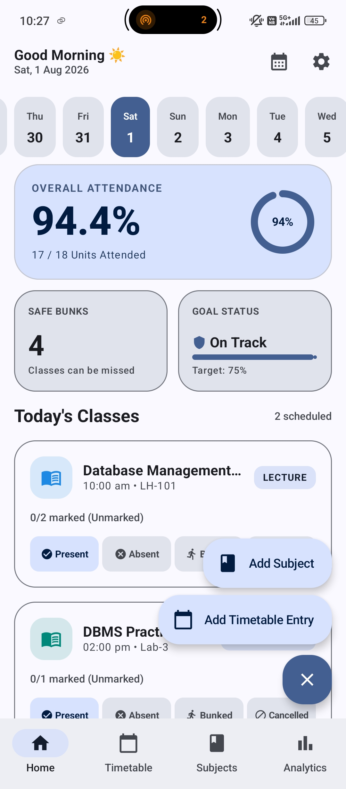
  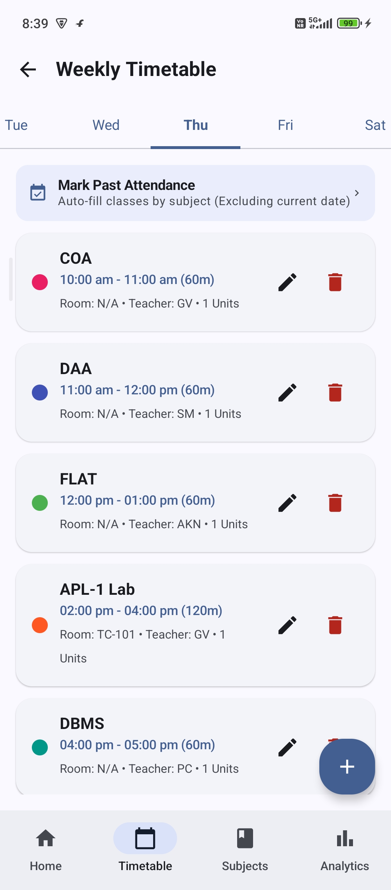
  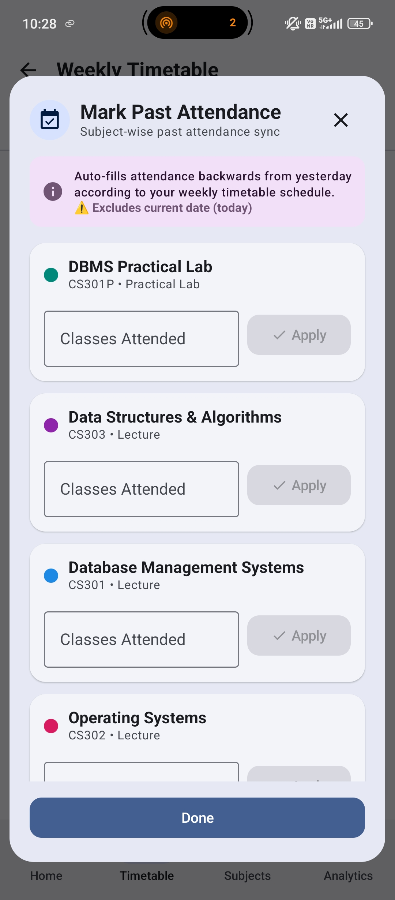
  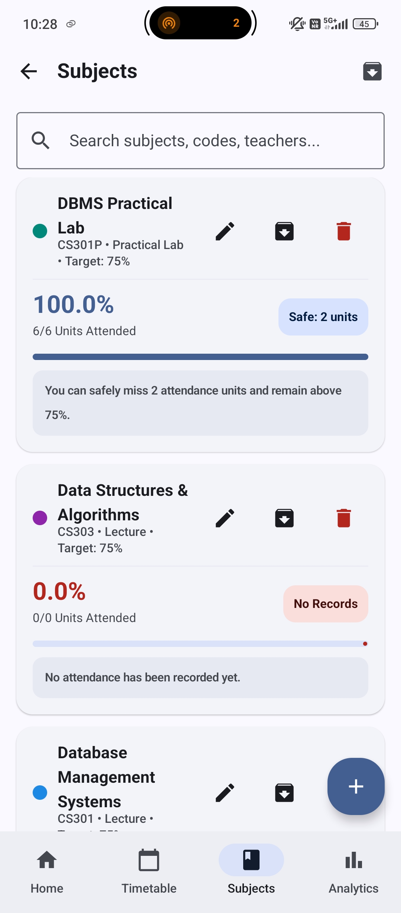
  <br/>
  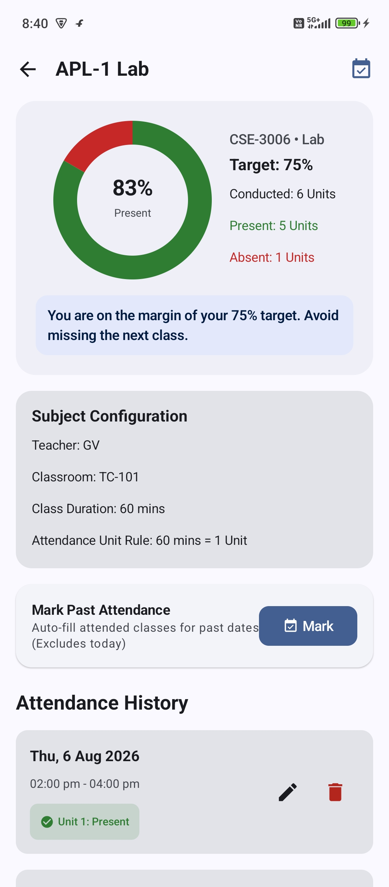
  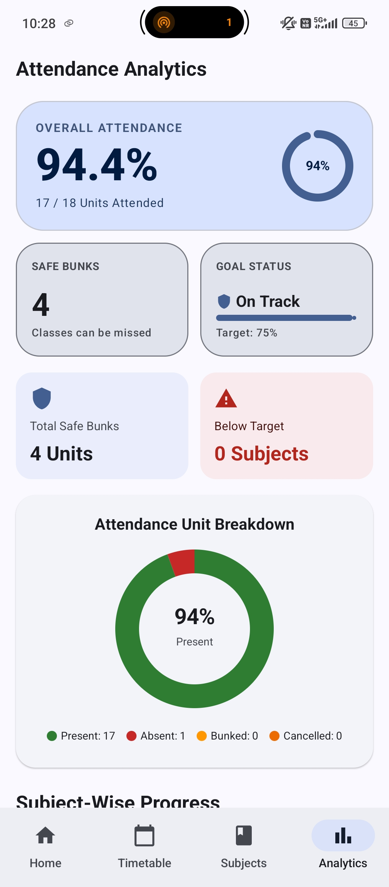
  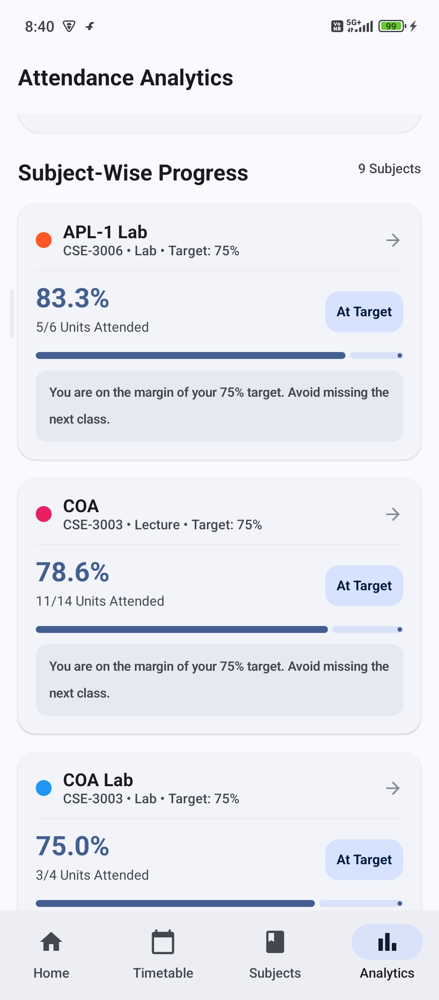
  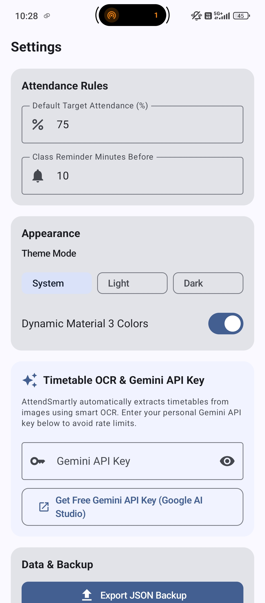
  <br/>
  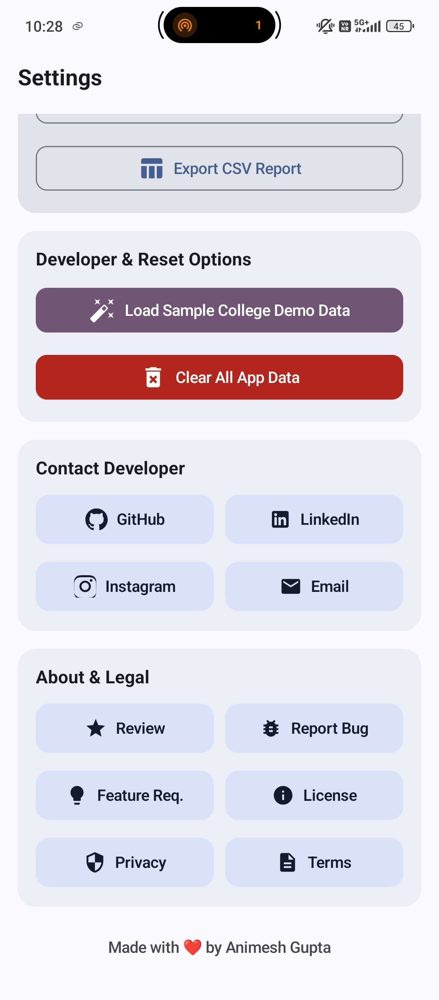
  <!-- 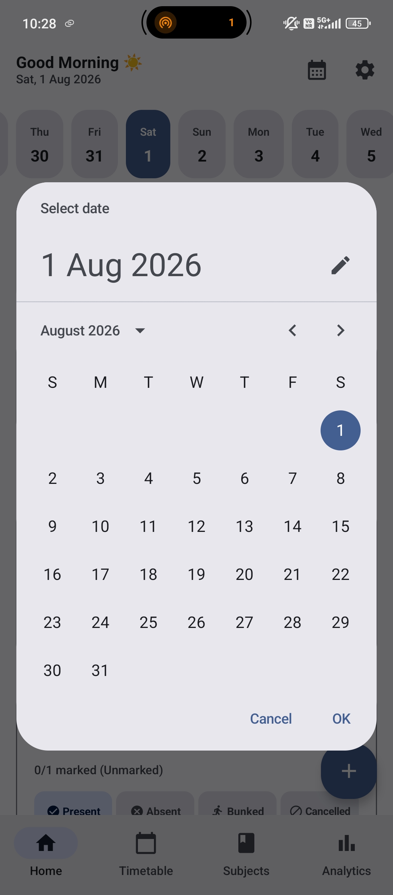 -->
  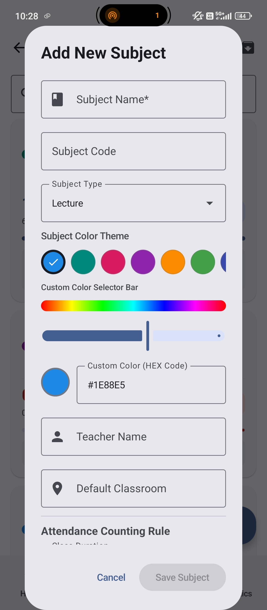
  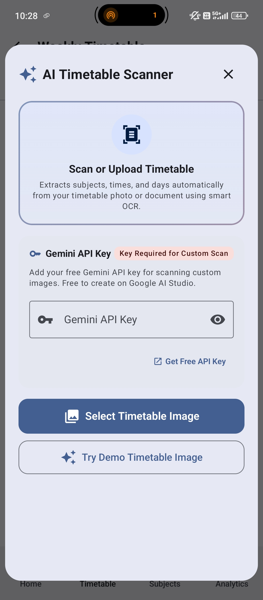
  <br/>
  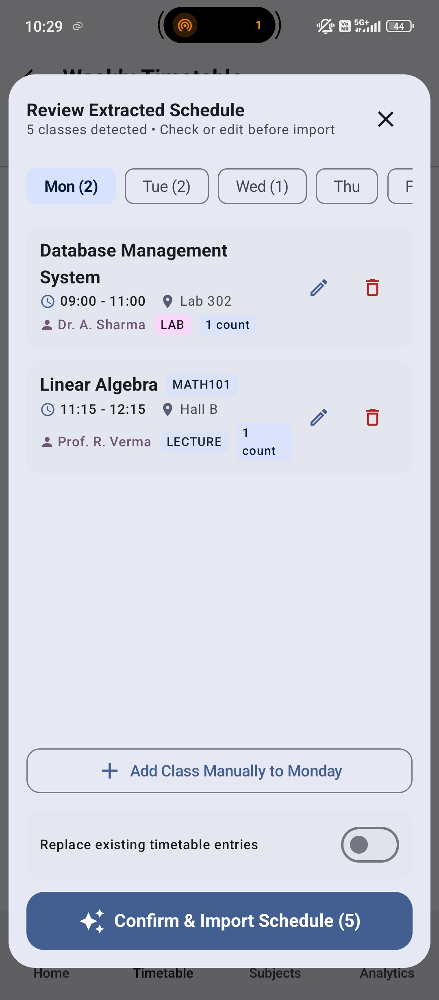
</div>

---

## 🚀 Getting Started & Installation

### Option 1: Download APK
1. Go to the [Releases](https://github.com/agupta07505/AttendSmartly/releases) page.
2. Download the latest `AttendSmartly-Release.apk`.
3. Install the APK on your Android device (Android 7.0 / API 24 or higher).

### Option 2: Build from Source
Requirements:
- Android Studio Ladybug (2024.2.1) or newer
- JDK 17
- Android SDK 34+

```bash
# 1. Clone the repository
git clone https://github.com/agupta07505/AttendSmartly.git
cd AttendSmartly

# 2. Build Debug APK
./gradlew assembleDebug

# 3. Run Unit Tests
./gradlew testDebugUnitTest
```

---

## ❓ Frequently Asked Questions (FAQ)

<details>
<summary><b>1. Is AttendSmartly completely free and offline?</b></summary>
<br/>
Yes! AttendSmartly is 100% free, open-source software licensed under the GNU GPL v3. All attendance logs, timetables, and settings are stored locally on your device in an encrypted Room Database. No data is sent to external tracking servers.
</details>

<details>
<summary><b>2. How does the Safe Bunk Calculator work?</b></summary>
<br/>
The safe bunk calculator evaluates your target percentage (e.g. 75%), your total present units, and total conducted units. It mathematically calculates the maximum number of future classes you can miss without falling below your target threshold.
</details>

<details>
<summary><b>3. What happens if a teacher cancels a lecture?</b></summary>
<br/>
You can mark the session as <b>Cancelled</b>. Cancelled units are excluded from total conducted classes, ensuring your attendance percentage remains completely untouched.
</details>

<details>
<summary><b>4. How do I use the Smart Timetable OCR Scanner?</b></summary>
<br/>
In the Timetable screen, select the OCR Scanner option and upload an image of your college timetable. You can optionally enter your personal free Google Gemini API key from Google AI Studio to perform automatic schedule extraction.
</details>

---

## 🔒 Privacy & Open Source

AttendSmartly values your privacy. It contains **zero telemetry**, **zero analytics SDKs**, and **zero hidden tracking**. All student data remains exclusively on your device.

Read our full policies:
- [Privacy Policy](PRIVACY.md)
- [Terms of Service](TERMS.md)
- [Security Policy](SECURITY.md)
- [5W2H Analysis](5W2H.md)

---

## 📄 Author & License

Designed and developed with ❤️ by **Animesh Gupta** ([@agupta07505](https://github.com/agupta07505)).

```text
AttendSmartly (2026)
© Animesh Gupta — github.com/agupta07505
Licensed under the GNU General Public License v3.0 (GPL-3.0).
```

*See the [LICENSE](LICENSE) file for full legal terms.*
